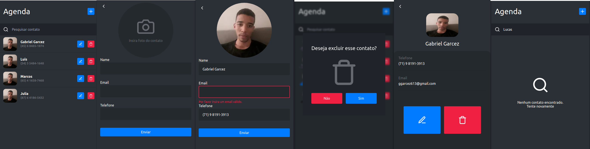

<h1 align="center">
  PhoneBook
</h1>

<p align="center">
  
</p>

## Sobre o Projeto

Aplicação de agenda telefônica desenvolvida em ReactJS, NodeJS e PostgresSQL.

## Funcionalidades

[x] Criar contato.

[x] Listar contato.

[x] Pesquisar contato na lista.

[x] Visualizar perfil de contato.

[x] Atualizar dados de contato.

[x] Deletar contato.

[x] Responsividade.

[x] Cache e prefetch de dados.


## Feito com:
 ### Frontend
- [ReactJS](https://github.com/facebook/react) - Biblioteca Javascript para construção de interfaces.
- [Next.js](https://github.com/vercel/next.js) - Framework React JS.
- [TailwindCSS](https://tailwindcss.com/) - Utility first framework para CSS.
- [Typescript](https://github.com/microsoft/TypeScript) - Supertset para Javascript.
- [React-modal](https://github.com/reactjs/react-modal) - Biblioteca para construção de modal.
- [React-hook-form](https://github.com/react-hook-form/react-hook-form) - Biblioteca para forulários.
- [React Query](https://react-query.tanstack.com/) - Biblioteca para fetch, cache e update de dados.
 
 ### Backend
- [Node.js](https://nodejs.org/en/) - Plataforma para Javascript no Backend.
- [Express.js](https://expressjs.com/) - Framework servidor web para NodeJS.
- [Prisma](https://www.prisma.io/) - ORM.
- [Multer](https://github.com/expressjs/multer) - Biblioteca para upload de arquivos.
- [PostgresSQL](https://www.postgresql.org/) - Banco de dados relacional.
- [Tsyringe](https://github.com/microsoft/tsyringe) - Biblioteca para injeção de dependências.

## Como executar

- Clone do repositório
```
$ git clone https://github.com/Garcez17/Phonebook

$ cd Phonebook
```
- Entre nas pastas de cada projeto
  * Backend
```
$ cd server

$ yarn

$ yarn dev
```
 * Frontend
```
$ cd web

$ yarn

$ yarn dev
```

## Licença

Esse projeto está sob a licença MIT. Veja o arquivo [LICENSE](https://github.com/Garcez17/Move-It/blob/main/LICENSE) para mais detalhes.